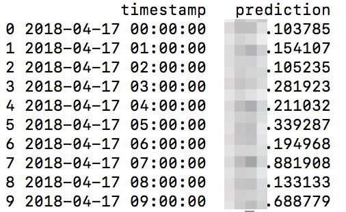

# forecast_sms

Used to (potentially) forecast sms spend for FxA.

## Dependencies (as of right now)
* python2.7 or 3 (tried both seems to work)
* These python libs (`pip install`):
  * pandas
  * numpy
  * statsmodels
  * for console print-formatting only: tqdm, tabulate

## Usage Example
Definitely liable to change, but as of now:
`python forecast_sms.py [datafile.json] [days_out_to_predict] [q_upper_limit]`

e.g.

`python forecast_sms.py sms-spend.json 7 0`

where `7` is how  many **days** after the last hour in your data to predict out. Predictions that are generated are hour by hour. Obviously predictions will be worse the further out you try to predict. If you don't include the hours it will spit out 24 by default.

The last optional parameter controls whether a search is done for better model parameters. The larger the number the more it will search, with numbers > 10 taking a long time. If the this parameter is 0 or omitted, a pre-defined set of parameters that I've found to to work decently will be used instead.

I suggest trying the default parameters first, then if need be setting the last parameter to 5 and see if the AIC improves (lower the better).



Tested with some test data that's not included in this repo.

## Data Format

**Currently data must be generated with the following command**:

```aws --profile prod cloudwatch get-metric-statistics --namespace 'AWS/SNS' --metric-name 'SMSMonthToDateSpentUSD' --start-time '2018-04-01T00:00:00Z' --end-time '2018-04-17T00:00:00Z' --period '3600' --statistics 'Average' > sms-spend.json```

Just sub out the timestamps for the date range you want.
